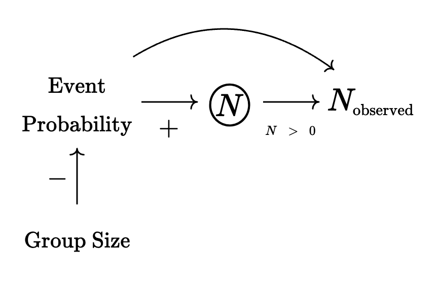

```{r setup, include=FALSE}
knitr::opts_chunk$set(echo = TRUE)
```

The purpose of this notebook is to proof the importance of this method by testing it on simulated data with known parameters.

```{r, message=FALSE}
library(seaR)
#load_all()
library(tidyverse)
theme_set(theme_linedraw(base_family = "Avenir Next Condensed"))
```

## Simple Random Mixing Model

Let's start with a simple model with two gender identities, three occupational identities, and group sizes ranging from 1 to 10.

```{r}
gender <- c("M", "F")
occupation <- c("A", "B", "C", "D")
risk_set_size(1:10, gender, occupation)
rs <- risk_set(1:10, gender, occupation)
glimpse(rs)
```

I will store the individual identities in this risk set in a vector named `identities`.

```{r}
identities <- get_identities(rs)
identities
```

I will assume the following marginal probabilities:

```{r}
p1 <- c("M" = 0.7, "F" = 0.3)
p2 <- c("A" = 0.2, "B" = 0.3, "C" = 0.4, D = 0.1)
```

*Note. You would normally estimate these joint probabilities from a dataset instead of assuming that they are independent.*

```{r}
jp <- outer(p1, p2) ## joint probabilities under independence 
probs <- vector("double", length(jp))

for (i in seq_along(probs)) {
  probs[[i]] <- as.vector(jp)[[i]]
}

names(probs) <- identities

## calculate event probabilities, here given as log(p)
rs$lp <- event_probs(rs, identities, probs = probs, log = TRUE)
jp
probs
glimpse(rs)
```

Note that these event probabilities sum up to one if we condition on group size. (See definitions).

```{r}
rs |> 
  group_by(.size) |> 
  summarize(p = exp(log_sum_exp(lp))) 
```

### Model Parameters

Now I will simulate observations from the following model:

$$
\begin{align}
N_i &\sim \text{Poisson}(\lambda_i) \\\\
\log(\lambda_i) &= 6 + \underbrace{\log(p_i)}_\text{offset}
\end{align}
$$

```{r}
d <- rs |> 
  ## simulate data from known parameters
  mutate(s = rpois(n(), exp(6 + lp)))
```

Among other things, this model implies that each "group size" gets roughly the same number of counts—i.e., there's no regression coefficient that incorporates group size.

```{r}
d |> 
  summarize(obs = sum(s), .by = .size)
```

We should also keep in mind that larger group size will make each event probability smaller and that—more importantly—we should see more zeroes at larger group sizes for the same reason.

```{r, echo=FALSE, message=FALSE}
d |> 
  mutate(.size = factor(.size)) |> 
  ggplot(aes(.size, lp)) + 
  geom_jitter(alpha = 1/4) + 
  stat_summary(color = "red") + 
  labs(x = "group size", y = "event probability (log)")

d |> 
  summarize(zero_prop = mean(s == 0), .by = .size) |> 
  mutate(.size = factor(.size)) |>
  ggplot(aes(.size, zero_prop)) + 
  geom_point() +
  geom_hline(yintercept = 1, linetype = "dashed") +
  labs(x = "group size", y = "proportion of zeroes")
```

Risk set:

```{r}
nrow(d)
```

Observed risk set:

```{r}
mean(d$s > 0) * nrow(d)
```

Now we are ready to see if we can recover the known parameters from the data.

### Results (Missing Data) 

**Results from using only groups that actually form (i.e., no zeroes).**

```{r}
d_sub <- filter(d, s > 0)

m1 <- glm(s ~ 1, family = "poisson", data = d_sub)
m2 <- glm(s ~ 1 + .size, family = "poisson", data = d_sub)
m3 <- glm(s ~ 1, family = "poisson", data = d_sub, offset = lp)
m4 <- glm(s ~ 1 + .size, family = "poisson", data = d_sub, offset = lp)

modelsummary::msummary(
  models = list(m1, m2, m3, m4), 
  stars = TRUE, 
  gof_map = c("nobs", "aic", "bic"),
  notes = "Models 1-2 don't include offset term. Model 3 is correctly specified.", 
  title = "Incomplete Risk Set (Missing Data)", 
  output = "gt"
) |> gt::opt_table_font("Avenir Next")
```

### Results (Complete Data) 

**Results from using all possible groups.**

```{r}
m1 <- glm(s ~ 1, family = "poisson", data = d)
m2 <- glm(s ~ 1 + .size, family = "poisson", data = d)
m3 <- glm(s ~ 1, family = "poisson", data = d, offset = lp)
m4 <- glm(s ~ 1 + .size, family = "poisson", data = d, offset = lp)

modelsummary::msummary(
  models = list(m1, m2, m3, m4), 
  stars = TRUE, 
  gof_map = c("nobs", "aic", "bic"),
  notes = "Models 1-2 don't include offset term. Model 3 is correctly specified.", 
  title = "Complete Risk Set", 
  output = "gt"
) |> gt::opt_table_font("Avenir Next")
```

*Technical Discussion.*

-   *The standard errors are super small, which makes it suspicious to apply the statistical significance framework in this context.*

-   *I don't understand why there's an effect for group size when using the the incomplete risk set adjusting for event probabilities (model 4). The effect of group size on* $N$ *should only operate via event probabilities.*

{width="60%"}

## Group Size Predictor

### Model Parameters

Now I will simulate observations from the following model:

$$
\begin{align}
N_i &\sim \text{Poisson}(\lambda_i) \\\\
\log(\lambda_i) &= 6 - 0.2 \cdot \text{size}_i + \underbrace{\log(p_i)}_\text{offset}
\end{align}
$$

```{r}
d <- rs |> 
  ## simulate data from known parameters
  mutate(s = rpois(n(), exp(6 + -0.2*.size + lp))) 
```

Among other things, this model implies that each "group size" gets roughly 18% less number of counts for each additional increase in size.

```{r}
d |> 
  summarize(obs = sum(s), .by = .size)
```

*Note. This means we also get much more missing data (i.e., events with 0 counts).*

Risk set:

```{r}
nrow(d)
```

Observed risk set:

```{r}
mean(d$s > 0) * nrow(d)
```

Now we are ready to see if we can recover the known parameters from the data.

### Results (Missing Data) 

**Results from using only groups that actually form (i.e., no zeroes).**

```{r}
d_sub <- filter(d, s > 0)

m1 <- glm(s ~ 1, family = "poisson", data = d_sub)
m2 <- glm(s ~ 1 + .size, family = "poisson", data = d_sub)
m3 <- glm(s ~ 1, family = "poisson", data = d_sub, offset = lp)
m4 <- glm(s ~ 1 + .size, family = "poisson", data = d_sub, offset = lp)

modelsummary::msummary(
  models = list(m1, m2, m3, m4), 
  stars = TRUE, 
  gof_map = c("nobs", "aic", "bic"),
  notes = "Models 1-2 don't include offset term. Model 4 is correctly specified.", 
  title = "Incomplete Risk Set (Missing Data)", 
  output = "gt"
) |> gt::opt_table_font("Avenir Next")
```

### Results (Complete Data) 

**Results from using all possible groups.**

```{r}
m1 <- glm(s ~ 1, family = "poisson", data = d)
m2 <- glm(s ~ 1 + .size, family = "poisson", data = d)
m3 <- glm(s ~ 1, family = "poisson", data = d, offset = lp)
m4 <- glm(s ~ 1 + .size, family = "poisson", data = d, offset = lp)

modelsummary::msummary(
  models = list(m1, m2, m3, m4), 
  stars = TRUE, 
  gof_map = c("nobs", "aic", "bic"),
  notes = "Models 1-2 don't include offset term. Model 3 is correctly specified.", 
  title = "Complete Risk Set", 
  output = "gt"
) |> gt::opt_table_font("Avenir Next")
```

{width="60%"}

## Group Size & Diversity Predictors

### Model Parameters

Now I will simulate observations from the following model:

$$
\begin{align}
N_i &\sim \text{Poisson}(\lambda_i) \\\\
\log(\lambda_i) &= 7 - 0.2 \cdot \text{size}_i + 0.3 \cdot \text{od}_i - 0.5 \cdot \text{gd}_i + \underbrace{\log(p_i)}_\text{offset}
\end{align}
$$

This presumes that whatever we expect to less groups with gender diversity (or more groups with gender homophily) and more groups with occupational diversity (or less groups with occupational homophily).

The `seaR` package includes function called `H()` which calculates Shannon's entropy measurement, which is also a common measurement of diversity in the ecological literature.

```{r}
rs$gender_div <- H(rs, gender)
rs$occupation_div <- H(rs, occupation)

d <- rs |> 
  ## simulate data from known parameters
  mutate(s = rpois(n(), exp(7 - 0.2*.size + 0.3*occupation_div - 0.5*gender_div + lp))) 
```

To get a sense of what this means, the following plot takes a random sample of groups and shows their corresponding measures of diversity.

```{r, echo = FALSE}
rs |> 
  slice_sample(n = 2, by = .size) |> 
  mutate(.id = fct_reorder(.id, .size, .desc = TRUE)) |> 
  pivot_longer(
    cols = ends_with("div"), 
    names_to = "type", 
    names_transform = \(x) str_remove(x, "_div")
  ) |> 
  ggplot(aes(value, .id, color = type)) + 
  geom_point(position = position_dodge(width = 1/2)) + 
  labs(y = NULL, x = "H", color = NULL)
```

Risk set:

```{r}
nrow(d)
```

Observed risk set:

```{r}
mean(d$s > 0) * nrow(d)
```

Now we are ready to see if we can recover the known parameters from the data.

### Results (Missing Data) 

**Results from using only groups that actually form (i.e., no zeroes).**

```{r}
d_sub <- filter(d, s > 0)

m1 <- glm(s ~ 1, family = "poisson", data = d_sub)
m2 <- glm(s ~ .size, family = "poisson", data = d_sub)
m3 <- glm(s ~ .size + occupation_div, family = "poisson", data = d_sub)
m4 <- glm(s ~ .size + gender_div, family = "poisson", data = d_sub)
m5 <- glm(s ~ .size + occupation_div + gender_div, family = "poisson", data = d_sub)

modelsummary::msummary(
  models = list(m1, m2, m3, m4, m5), 
  stars = TRUE, 
  gof_map = c("nobs", "aic", "bic"),
  notes = "Models 1-2 don't include offset term. Model 4 is correctly specified.", 
  title = "Incomplete Risk Set (Missing Data) || NO OFFSET", 
  output = "gt"
) |> gt::opt_table_font("Avenir Next")
```

```{r}
m1 <- glm(s ~ 1, family = "poisson", data = d_sub, offset = lp)
m2 <- glm(s ~ .size, family = "poisson", data = d_sub, offset = lp)
m3 <- glm(s ~ .size + occupation_div, family = "poisson", data = d_sub, offset = lp)
m4 <- glm(s ~ .size + gender_div, family = "poisson", data = d_sub, offset = lp)
m5 <- glm(s ~ .size + occupation_div + gender_div, family = "poisson", data = d_sub, offset = lp)

modelsummary::msummary(
  models = list(m1, m2, m3, m4, m5), 
  stars = TRUE, 
  gof_map = c("nobs", "aic", "bic"),
  notes = "Models 1-2 don't include offset term. Model 4 is correctly specified.", 
  title = "Incomplete Risk Set (Missing Data) || INCLUDING OFFSET", 
  output = "gt"
) |> gt::opt_table_font("Avenir Next")
```

### Results (Complete Data) 

**Results from using all possible groups.**

```{r}
m1 <- glm(s ~ 1, family = "poisson", data = d)
m2 <- glm(s ~ .size, family = "poisson", data = d)
m3 <- glm(s ~ .size + occupation_div, family = "poisson", data = d, offset = lp)
m4 <- glm(s ~ .size + gender_div, family = "poisson", data = d, offset = lp)
m5 <- glm(s ~ .size + occupation_div + gender_div, family = "poisson", data = d, offset = lp)

modelsummary::msummary(
  models = list(m1, m2, m3, m4, m5), 
  stars = TRUE, 
  gof_map = c("nobs", "aic", "bic"),
  notes = "Models 1-2 don't include offset term. Model 3 is correctly specified.", 
  title = "Complete Risk Set", 
  output = "gt"
) |> gt::opt_table_font("Avenir Next")
```

*Technical Discussion.*

-   *The standard errors are super small, which makes it suspicious to apply the statistical significance framework in this context.*

## Massive 
